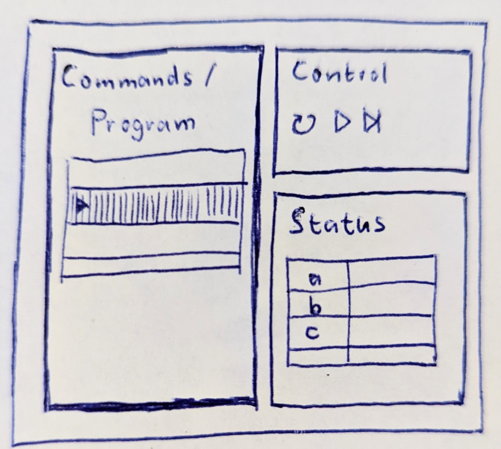

# Project: browsy-assembler

Play with assembler in your browser via wasm

## Status

Currently concept only, no implementation yet.

## App-description

Webapp with following components:

1. Code-viewport with lines of code (current line is selected)
2. Control-viewport with execution control buttons (pause / step)

Steps after that:

3. Registers-viewport
4. Memory-viewport

## Goals for me

* Be able to show and emulate execution of RISC-V asm commands
* Learning tool for me

## Sketch

## License

See also: [LICENSE](LICENSE)-File

`SPDX-License-Identifier: Apache-2.0 OR MIT`

